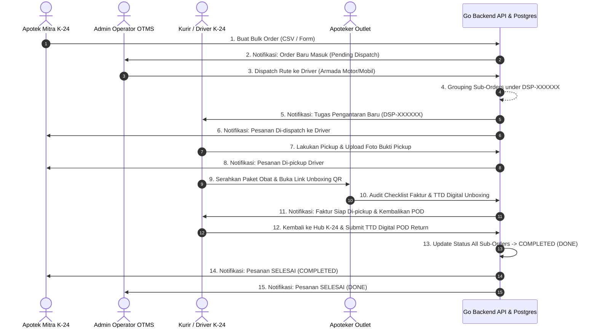

# 🚚 K-24 Logistics & OTMS Platform (Order Transportation Management System)

<div align="center">


**Sistem Manajemen Logistik & OTMS Pengiriman Obat Terintegrasi untuk Apotek K-24 Indonesia.**  
Mencakup **Aplikasi Kurir Mobile (Flutter)**, **Web Operator Dashboard & Dispatch System (Next.js 16)**, dan **Backend API Microservice (Go & PostgreSQL)**.

</div>

---

## 📑 Daftar Isi

- [💡 Overview Platform](#-overview-platform)
- [✨ Fitur Utama](#-fitur-utama)
  - [📱 1. Aplikasi Mobile Driver (Flutter)](#-1-aplikasi-mobile-driver-flutter)
  - [🖥️ 2. Web Operator Dashboard & OTMS (Next.js 16)](#️-2-web-operator-dashboard--otms-nextjs-16)
  - [⚙️ 3. Backend Microservice API (Go / Gin)](#️-3-backend-microservice-api-go--gin)
- [🏗️ Arsitektur Sistem & Workflow Alur Pesanan](#️-arsitektur-sistem--workflow-alur-pesanan)
- [🛠️ Spesifikasi Teknologi (Tech Stack)](#️-spesifikasi-teknologi-tech-stack)
- [📂 Struktur Direktori Repository](#-struktur-direktori-repository)
- [🚀 Panduan Instalasi & Jalankan Lokal (Getting Started)](#-panduan-instalasi--jalankan-lokal-getting-started)
  - [Prasyarat](#prasyarat)
  - [1. Database PostgreSQL Setup](#1-database-postgresql-setup)
  - [2. Backend API Setup (Go Server)](#2-backend-api-setup-go-server)
  - [3. Web Dashboard Setup (Next.js 16)](#3-web-dashboard-setup-nextjs-16)
  - [4. Mobile Driver App Setup (Flutter)](#4-mobile-driver-app-setup-flutter)
- [📡 Ringkasan API Endpoints](#-ringkasan-api-endpoints)
- [🌐 Panduan Deployment ke Production Server](#-panduan-deployment-ke-production-server)
- [📄 Lisensi](#-lisensi)

---

## 💡 Overview Platform

**K-24 Logistics & OTMS Platform** dirancang khusus untuk memodernisasi dan mengotomatisasi pengiriman obat, perbekalan farmasi, serta faktur fisik dari Gudang K-24 ke seluruh jaringan Apotek Mitra K-24.

Platform ini memecahkan kompleksitas pengiriman multi-titik (*multi-stop delivery*), penugasan driver cerdas berdasarkan tipe armada (Motor/Mobil), pengelompokan nomor dispatch (`DSP-XXXXXX`), verifikasi faktur fisik oleh Apoteker (*Unboxing Audit*), hingga pengembalian dokumen POD (*Proof of Delivery*) ber-tanda tangan digital.

---

## ✨ Fitur Utama

### 📱 1. Aplikasi Mobile Driver (Flutter)
- **Interactive Route & Stops**: Menampilkan urutan rute pengantaran multi-titik (*multi-stop*) dengan estimasi jarak Haversine.
- **In-App HTTP Debug Inspector (`kDebugMode`)**: Floating badge & modal inspector bawaan aplikasi untuk memantau request/response API, HTTP status, headers, serta format pretty JSON secara real-time saat fase pengujian/development.
- **Dynamic Grouping**: Mengelompokkan sub-order dari 1 rute dispatch yang sama under unified ID (`DSP-XXXXXX` / `ORDER-XXXXXX`).
- **Bukti Pickup & Serah Terima**: Pengunggahan foto bukti pickup dan foto faktur fisik langsung dari kamera/galeri.
- **Canvas Tanda Tangan Digital**: Tanda tangan digital berformat Base64 untuk Apoteker penerima dan Pengembalian POD K-24.
- **Real-Time Push Notifications**: Notifikasi instan saat driver mendapat tugas dispatch baru, invoice siap di-pickup, atau persetujuan penolakan.

### 🖥️ 2. Web Operator Dashboard & OTMS (Next.js 16)
- **OTMS Dispatch Operator**: Penugasan driver cepat dengan filtering tipe armada (Motor/Mobil), estimasi jarak total, dan pembuatan nomor dispatch otomatis (`DSP-XXXXXX`).
- **Live Real-Time Web Notifications**: Bell notification popover di header web dengan badge counter belum dibaca + Toast Notification melayang (Sonner) setiap ada event Dispatch, Pickup, Unboxing, atau Order Completed (DONE).
- **Portal Apotek Mitra**: Pembuatan pesanan tunggal maupun masal (*Bulk Shipment CSV Upload*) dengan kalkulasi ongkir otomatis berbasis rumus tarif K-24.
- **Ringkasan Invoices Flat & Laporan**: Pemantauan status per-invoice fisik, pencetakan rincian faktur, dan ekspor data.
- **Public Pharmacist Unboxing UI (`/apoteker/unbox/[orderId]`)**: Layar khusus Apoteker penerima obat di outlet K-24 untuk centang checklist faktur fisik, foto barang tambahan/rusak, dan tanda tangan digital tanpa perlu login akun.

### ⚙️ 3. Backend Microservice API (Go / Gin)
- **High-Performance Go Engine**: RESTful API super cepat dibangun dengan **Golang 1.22**, **Gin Framework**, dan **PGX Pool v5** untuk koneksi PostgreSQL efisien.
- **Matriks Tarif & Routing Haversine**: Perhitungan jarak geografis latitude/longitude presisi tinggi untuk menghitung ongkir armada motor & mobil.
- **Otomatisasi Database Migrations**: Eksekusi file SQL migrasi berurutan (`000001` hingga `000012`) secara otomatis saat backend pertama kali dijalankan.
- **Keamanan JWT & Role-Based Access**: Proteksi endpoint bergradasi untuk **ADMIN**, **MITRA**, dan **DRIVER**.

---

## 🏗️ Arsitektur Sistem & Workflow Alur Pesanan



---

## 🛠️ Spesifikasi Teknologi (Tech Stack)

| Sektor | Teknologi / Library | Versi | Deskripsi |
| :--- | :--- | :--- | :--- |
| **Mobile App** | Flutter / Dart | `^3.x` | Multi-platform Mobile App untuk Kurir / Driver |
| **Web Dashboard**| Next.js / React | `16.2.10` / `19.2` | Web Application dengan Turbopack & App Router |
| **Styling Web** | Tailwind CSS / Lucide | `v4` / `1.24` | Modern UI styling, dark/light mode, & glassmorphism |
| **Toast & Popover**| Sonner | `^2.0` | Real-time web notification toast engine |
| **Backend Engine**| Go (Golang) / Gin | `1.22` / `^1.9` | High-performance RESTful Microservice API |
| **Database** | PostgreSQL / PGX | `14+` / `v5` | Relational Database & High Concurrency Connection Pool |
| **Peta & GIS** | Leaflet / OpenStreetMap | `^1.9` | Interactive Map Routing & Coordinates Picker |

---

## 📂 Struktur Direktori Repository

```text
K24-APPS-/
├── android/                   # Flutter Native Android Configuration
├── ios/                       # Flutter Native iOS Configuration
├── lib/                       # 📱 Flutter Mobile Source Code
│   ├── main.dart              # Entrypoint Mobile App (HttpDebugOverlay Wrapper)
│   ├── models/                # Data Models (DashboardData, OrderModel, etc.)
│   ├── pages/                 # UI Screens (LoggedScreen, VerifikasiPODPage, etc.)
│   ├── services/              # API Client & HttpDebugLogger Service
│   ├── widgets/               # HttpDebugOverlay Badge & Inspector Modal
│   └── components/            # Reusable SignaturePad & Order Cards
├── web_k24/k24-nextjs/        # 🖥️ Next.js Web Dashboard Application
│   ├── src/app/               # Next.js App Router (Dashboard, Orders, Dispatch, Unbox)
│   ├── src/components/        # Topbar (Notif Popover), Sidebar, DashboardShell
│   ├── src/context/           # AuthContext & NotificationContext
│   └── src/lib/               # Axios API Client & Proxy Interceptors
├── backend_k24apps/           # ⚙️ Go Backend Microservice API
│   ├── main.go                # Entrypoint Backend Server (Port 8087)
│   ├── config/                # Environment & Database Config
│   ├── migrations/            # SQL Auto Migration Files (000001 - 000012)
│   └── internal/
│       ├── handlers/          # API Handlers (Admin, Dispatch, Orders, Notifications)
│       ├── middleware/        # JWT Auth Middleware & CORS Config
│       └── models/            # Go Struct Models & API Responses
└── README.md                  # Project Documentation
```

---

## 🚀 Panduan Instalasi & Jalankan Lokal (Getting Started)

### Prasyarat
Pastikan environment lokal Anda telah terinstall:
- **Go**: `v1.22` atau lebih baru
- **Node.js**: `v20.x` atau lebih baru
- **Flutter SDK**: `v3.x` atau lebih baru
- **PostgreSQL**: `v14` atau lebih baru

---

### 1. Database PostgreSQL Setup

Buat database baru bernama `k24` pada PostgreSQL Anda:

```bash
psql -U postgres -c "CREATE DATABASE k24;"
```

---

### 2. Backend API Setup (Go Server)

1. Masuk ke direktori backend:
   ```bash
   cd backend_k24apps
   ```
2. Buat file `.env` di dalam folder `backend_k24apps`:
   ```ini
   PORT=8087
   DB_HOST=127.0.0.1
   DB_PORT=5432
   DB_USER=postgres
   DB_PASSWORD=admin123
   DB_NAME=k24
   JWT_SECRET=super_secret_jwt_k24_key_2026
   ```
3. Jalankan backend (migrasi database SQL `000001` - `000012` akan berjalan otomatis):
   ```bash
   go run main.go
   ```
   *Backend API akan aktif di `http://localhost:8087`.*

---

### 3. Web Dashboard Setup (Next.js 16)

1. Masuk ke direktori frontend web:
   ```bash
   cd web_k24/k24-nextjs
   ```
2. Install dependensi Node:
   ```bash
   npm install
   ```
3. Buat file `.env.local`:
   ```ini
   NEXT_PUBLIC_API_URL=http://localhost:8087
   ```
4. Jalankan dev server Next.js:
   ```bash
   npm run dev
   ```
   *Buka browser dan akses Web Dashboard di `http://localhost:3000`.*

---

### 4. Mobile Driver App Setup (Flutter)

1. Masuk ke root direktori repository:
   ```bash
   cd /path/to/apps_k24
   ```
2. Dapatkan dependensi Flutter:
   ```bash
   flutter pub get
   ```
3. Jalankan aplikasi di Emulator / Device:
   ```bash
   flutter run
   ```

---

## 📡 Ringkasan API Endpoints

Berikut adalah beberapa endpoint utama yang disediakan oleh Backend Go API (`http://localhost:8087/api`):

| Method | Endpoint | Akses | Deskripsi |
| :--- | :--- | :--- | :--- |
| `POST` | `/api/auth/login` | Publik | Authentication login untuk Admin, Mitra, dan Driver |
| `GET` | `/api/notifications` | Protected | Ambil daftar notifikasi real-time pengguna |
| `POST` | `/api/notifications/read` | Protected | Tandai semua notifikasi pengguna telah dibaca |
| `GET` | `/api/admin/orders` | Admin/Mitra | Mengambil daftar semua order & kelompok dispatch |
| `POST` | `/api/admin/orders/bulk` | Mitra | Membuat pesanan massal / CSV bulk order |
| `POST` | `/api/admin/dispatch` | Admin | Menugaskan rute pengantaran ke driver (`DSP-XXXXXX`) |
| `GET` | `/api/driver/dashboard` | Driver | Mengambil data tugas pengantaran aktif kurir |
| `POST` | `/api/driver/orders/:id/pickup` | Driver | Mengunggah foto bukti pickup obat di lokasi |
| `POST` | `/api/public/orders/:id/unbox` | Publik (Apoteker)| Centang checklist faktur & TTD digital unboxing |
| `POST` | `/api/public/orders/:id/pod-complete`| Driver/K-24 | Submit TTD digital pengembalian POD & tandai COMPLETED |

---

## 🐳 Docker Deployment Setup (Server Production)

Seluruh service (PostgreSQL, Backend API Go, dan Web Dashboard Next.js 16) telah dikonfigurasi menggunakan **Docker & Docker Compose**:

| Service | Container Name | Port Server (Host) | Internal Port | Environment / Image |
| :--- | :--- | :--- | :--- | :--- |
| **⚙️ Backend API (Go)** | `k24_backend` | **`9001`** | `8087` | Golang 1.22 Alpine Multi-Stage |
| **🖥️ Web Dashboard (Next.js)**| `k24_frontend` | **`9002`** | `3000` | Node 20 Alpine Standalone |
| **🗄️ Database (Postgres)** | `k24_postgres` | `5432` | `5432` | PostgreSQL 16 Alpine |

### 🚀 Cara Deploy di Server dengan Docker Compose:

1. Clone repository ke server Anda:
   ```bash
   git clone git@github.com:Cpixiee/K24-APPS-.git
   cd K24-APPS-
   ```
2. Jalankan seluruh service dengan 1 perintah:
   ```bash
   docker compose up -d --build
   ```

3. Akses aplikasi:
   - **Backend API**: `http://IP-SERVER-ANDA:9001/api`
   - **Web Dashboard**: `http://IP-SERVER-ANDA:9002`

### 🛠️ Perintah Manajemen Docker Useful:

```bash
# Cek status seluruh container
docker compose ps

# Lihat log real-time Backend
docker compose logs -f backend

# Lihat log real-time Frontend Web
docker compose logs -f frontend

# Stop dan hapus container
docker compose down
```

---

## 🌐 Panduan Manual Deployment (Tanpa Docker)

Jika Anda ingin memasang platform ini secara manual tanpa Docker pada Server Linux (Ubuntu/Debian):

### 1. Build Backend Go Binary
```bash
cd backend_k24apps
go build -o k24-backend main.go
```
Jalankan file biner `k24-backend` sebagai service Systemd (`/etc/systemd/system/k24-backend.service`).

### 2. Build Production Web Next.js
```bash
cd web_k24/k24-nextjs
npm run build
```
Jalankan menggunakan PM2:
```bash
pm2 start npm --name "k24-web" -- start
```

---

## 📄 Lisensi

Copyright © 2026 **Apotek K-24 Indonesia**. All Rights Reserved.  
Sistem ini dikembangkan secara eksklusif untuk operasional logistik dan jaringan franchise Apotek K-24.
